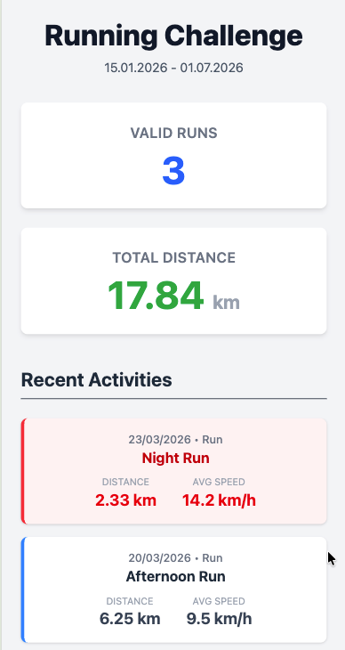

# 🏃‍♂️ Running Challenge 2026



## 🍻 What's this?

This is a web-based dashboard built for one very important reason: **a bet between friends.** 

We're tracking one specific friend to see if they can actually run a certain number of kilometers between `15.01.2026` and `01.07.2026`. The app hooks into their Strava, pulls in their runs behind the scenes, and puts the stats (valid runs, total distance, and recent activities) on blast for all of us to see. No hiding, no excuses!

## 🛠️ The Tech Stack (How I'm stalking them)

It looks simple on the outside, but I built it to be blazing fast and completely automated so we don't have to check Strava manually.

- **Framework**: [Astro](https://astro.build) (because I wanted it fast, without any bundled javascript)
- **Styling**: [Tailwind CSS v4](https://tailwindcss.com/) (to make the shame look good)
- **Data Source**: Strava API
- **Caching / Storage**: Redis (via `ioredis` in Docker) for keeping the stats handy
- **Deployment**: [Netlify](https://www.netlify.com/)

## 🚀 How it works (The Push Model)

Instead of the site fetching their data every single time one of us opens the dashboard (which is slow and inefficient, especially on a Netlify free tier), I decided to do it the following way:

I set up an API endpoint (`/api/webhook`) that literally waits for Strava to ping it the second our friend finishes a run. As soon as that webhook is hit, it fires off a trigger to Netlify to rebuild the whole site statically with the new numbers. The dashboard is always 100% static, loads instantly, and has zero API limits or cold starts holding it up. 

## 💻 Running it locally

Want to run this yourself to track your own friends?

### Prerequisites
- Node.js (v18+)
- Docker (for the local Redis database)

### Setup 

1. **Spin up Redis**
   Get the local Redis container running:
   ```bash
   docker-compose up -d
   ```

2. **Install everything**
   ```bash
   npm install
   ```

3. **Get your environment variables right**
   Set up your `.env` file with your Strava and Netlify credentials:
   ```env
   STRAVA_VERIFY_TOKEN=your_verify_token
   NETLIFY_BUILD_HOOK=your_build_hook_url
   # Add your specific Redis and Strava OAuth keys here too
   ```

4. **Start the server**
   ```bash
   npm run dev
   ```
   Boom. It's live at `http://localhost:4321`.

## 📜 Cheat sheet

| Command                   | What it does                                     |
| :------------------------ | :----------------------------------------------- |
| `npm install`             | Installs dependencies                            |
| `npm run dev`             | Starts local dev server at `localhost:4321`      |
| `npm run build`           | Build your production site to `./dist/`          |
| `npm run preview`         | Preview your build locally, before deploying     |
| `docker-compose up -d`    | Starts the local Redis container                 |
